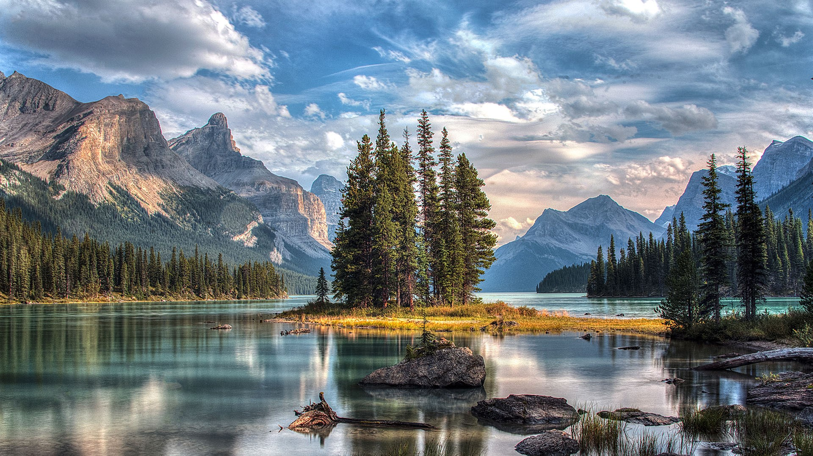
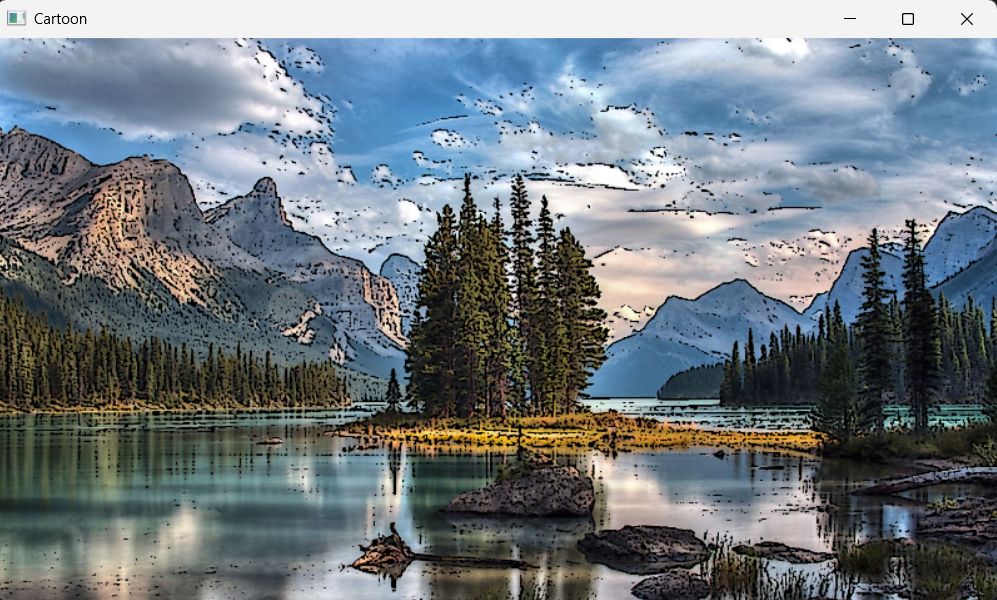
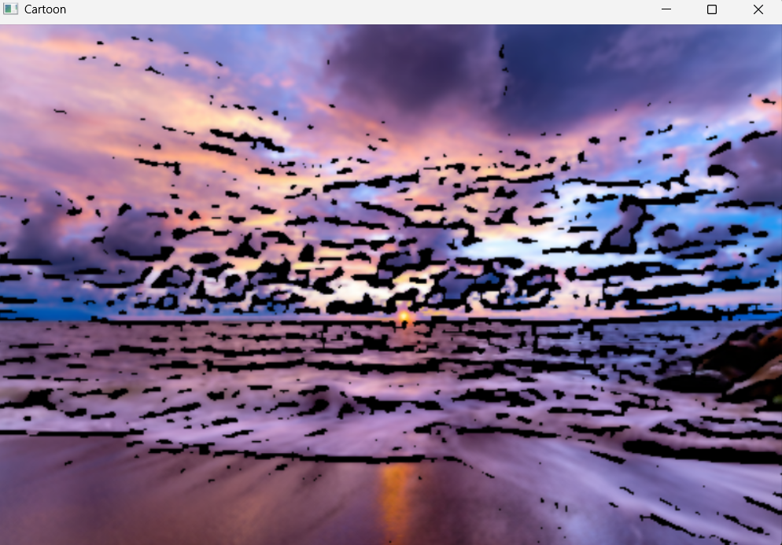

# Cartoonizer
# 잘 표현된 사진 예시
필터링 적용전 
필터링 적용후 

# 잘 표현되지 않는 사진 예시
필터링 적용전\

필터링 적용후

# 한계점
잘 표현된 사진은 아래 그림에 비해서 복잡한 윤과선이 적은데 비해
잘 표현되지 않은 사진 경우는 단순한 필터링으로 처리하기에는 복잡한 윤곽선이 많다.
그래서 첫번째는 적당한 필터링이 적용됐지만
두번째 사진은 윤곽선이 많은 부분 생략되거나 혹은 특정 윤곽선이 너무 과장되어 보기 좋지 않은 결과를 내놓았다. 
